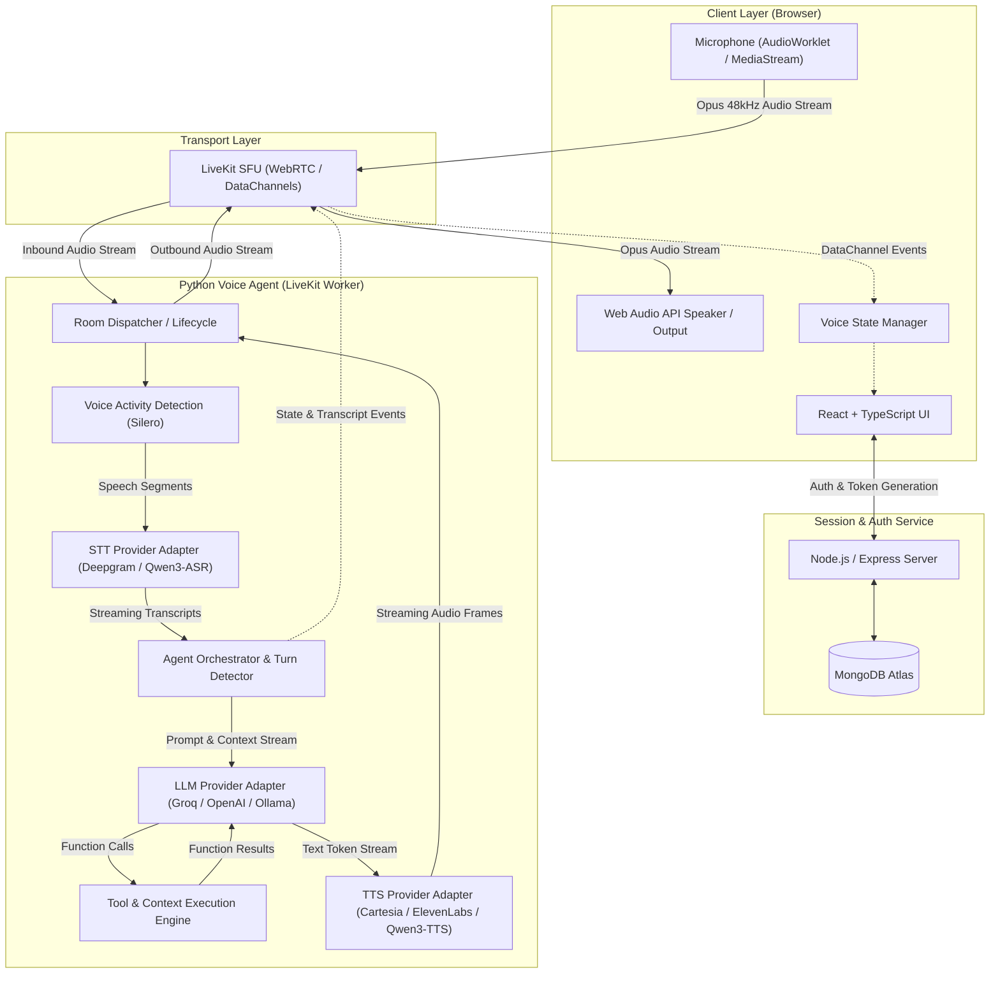
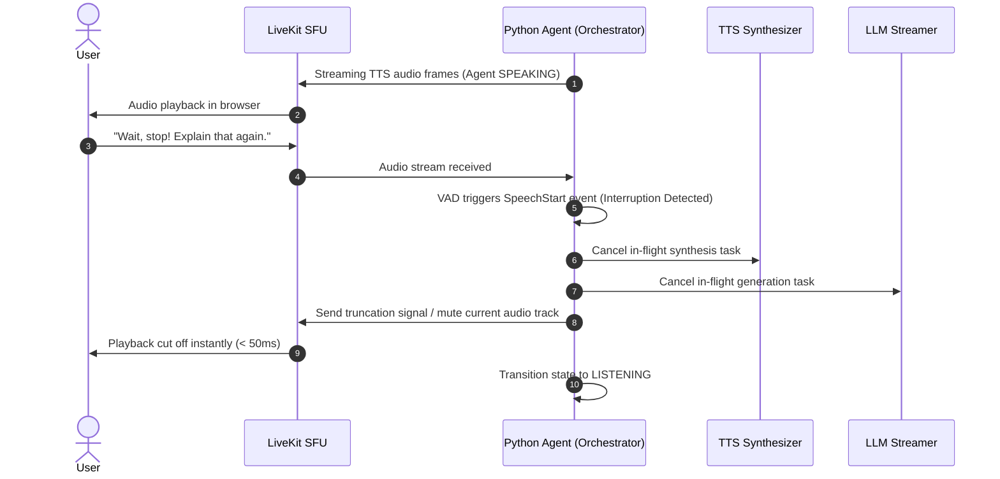

# System Architecture: Realtime Voice Agent

## 1. Overview & High-Level Architecture

The Realtime Voice Agent is designed for ultra-low latency, natural voice conversations with multilingual capabilities (English, Hindi, Hinglish). Rather than employing traditional request/response audio roundtrips, the system operates as a fully streaming, bi-directional pipeline orchestrated via WebRTC.



---

## 2. Core Components

### 2.1 Frontend Client (`frontend/`)
* **Technology:** React 19 / Vite, TypeScript (strict), Tailwind CSS.
* **Role:**
  * Requests room connection tokens from the Backend Token Service.
  * Captures user microphone audio via WebRTC and streams it directly to LiveKit.
  * Subscribes to the agent's outbound audio track with low-jitter playback buffer.
  * Renders conversation state (`IDLE`, `CONNECTING`, `LISTENING`, `THINKING`, `SPEAKING`, `ERROR`) and live transcripts.
  * Handles local audio volume metering and hardware mute controls.

### 2.2 Backend Token & API Service (`backend/`)
* **Technology:** Node.js, Express, Mongoose, MongoDB.
* **Role:**
  * Generates short-lived, cryptographically signed LiveKit JWT access tokens with granular room permissions.
  * Stores user profiles, persistent conversation logs, custom system prompts, and configuration.
  * Ensures zero secrets (LiveKit API secret, LLM/TTS keys) are ever transmitted to or exposed in the frontend.

### 2.3 Python Voice Agent Worker (`agent/`)
* **Technology:** Python 3.10+, `livekit-agents` runtime, `asyncio`.
* **Role:**
  * Connects to LiveKit SFU as an automated participant worker when a user room is created.
  * Manages the real-time audio pipeline: VAD → STT → LLM → TTS.
  * Handles immediate turn detection, conversational interruptions (barge-in), and tool execution.

---

## 3. Modular Adapter & Provider Interfaces

To ensure long-term sustainability, vendor neutrality, and support for local open-source models, all AI services are encapsulated behind pluggable provider adapters:

| Component | Default Cloud Adapter | Alternative / Local Open-Source Adapter | Target Latency |
| :--- | :--- | :--- | :--- |
| **VAD** | Silero VAD (ONNX, embedded) | WebRTC VAD | < 30ms |
| **STT** | Deepgram Nova-2 (WebSocket) | Qwen3-ASR / Whisper (local/GPU) | 100ms - 250ms |
| **LLM** | Groq (Llama-3.3 70B) / OpenAI (GPT-4o-mini) | Ollama (Qwen2.5 / Llama 3) / vLLM | 150ms - 350ms (TTFT) |
| **TTS** | Cartesia Sonic (WebSocket) / ElevenLabs | Qwen3-TTS / Kokoro / Piper | 80ms - 200ms (TTFA) |

### Provider Interface Contract
Each provider implements a clean abstract base class:
* `BaseSTT`: Ingests audio chunk stream; yields streaming transcript segments (interim + final).
* `BaseLLM`: Ingests chat message history and tool schemas; yields token stream and tool calls.
* `BaseTTS`: Ingests text token chunks; yields raw PCM/Opus audio frames.
* `BaseVAD`: Detects start-of-speech and end-of-speech events from raw audio buffers.

---

## 4. Latency Budget & Streaming Flow

For a human-like conversational experience, end-to-end response latency (from user stops speaking to agent starts speaking) must remain under **700ms - 900ms**.

```
[User finishes word]
  │
  ├─ 0ms - 100ms: VAD trailing silence detection (End of Turn)
  ├─ 100ms - 250ms: STT finalizes phrase transcript
  ├─ 250ms - 450ms: LLM receives transcript & yields Time-to-First-Token (TTFT)
  ├─ 450ms - 650ms: TTS synthesizes initial sentence clause (Time-to-First-Audio)
  └─ 650ms - 750ms: LiveKit WebRTC packet reaches browser & audio playback starts
[Agent speaks first word]
```

### Critical Latency Optimizations:
1. **Sentence / Clause Synthesizer Window:** Do not wait for complete LLM response generation. The TTS synthesizer begins streaming audio as soon as a punctuation boundary (comma, period, question mark) or 8-12 tokens are emitted.
2. **Audio Pre-buffering:** Jitter buffers are kept minimal (20ms-40ms) using WebRTC native mechanisms.
3. **No Intermediate Disk I/O:** Audio stays exclusively in memory as byte streams.

---

## 5. Interruption / Barge-In Lifecycle

Barge-in allows the user to cut off the agent at any moment while it is speaking:



---

## 6. Voice State Machine

The client and server synchronize over predefined states communicated through LiveKit DataChannels:

* **`IDLE`**: Ready and waiting for user input or session initiation.
* **`CONNECTING`**: Establishing WebRTC peer connection and joining the LiveKit room.
* **`LISTENING`**: Microphone active, VAD and STT streaming user audio.
* **`THINKING`**: User turn completed, STT finalized, LLM processing tokens / executing tools.
* **`SPEAKING`**: TTS streaming synthesized audio back to the client.
* **`ERROR`**: Network, hardware, or model failure with automatic retry fallback.

---

## 7. Security Principles

1. **Least Privilege Tokens:** LiveKit JWT tokens generated by Node.js backend grant access strictly to a single room with a short time-to-live (e.g., 10 minutes).
2. **Zero Client Secrets:** All third-party AI keys (Groq, OpenAI, Deepgram, Cartesia) reside exclusively within the Python Agent and Node.js backend environments.
3. **Data Sanitization:** Prompts, transcripts, and tool inputs are sanitized against injection attacks before dispatch.
