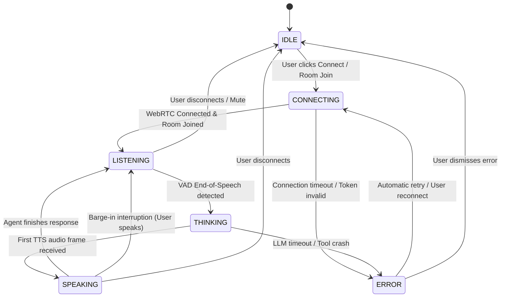

# Voice Agent State Machine Specification

The system transitions across six primary states to synchronize audio streaming, UI indicators, and event handling.

---

## 1. State Definitions

| State | Indicator Color | Audio Flow | Description |
| :--- | :--- | :--- | :--- |
| **`IDLE`** | Gray / Slate | Off | Room disconnected or agent standing by. Ready for user interaction. |
| **`CONNECTING`** | Amber / Orange | Handshaking | Requesting LiveKit token, negotiating WebRTC ICE candidates. |
| **`LISTENING`** | Emerald / Green | Inbound Only | Microphone active; VAD detecting speech; STT streaming transcripts. |
| **`THINKING`** | Blue / Violet | Internal Only | User speech turn complete; LLM generating tokens / executing tools. |
| **`SPEAKING`** | Cyan / Electric | Outbound Only | TTS streaming synthesized audio to client speaker. |
| **`ERROR`** | Rose / Red | Halted | Network dropped, token expired, or provider failure. Retry backoff active. |

---

## 2. Transition Diagram

---

## 3. Detailed Transition Triggers

1. **`IDLE` → `CONNECTING`**
   * **Trigger:** User clicks "Start Call" or toggles active connection.
   * **Actions:** Fetch JWT token from `POST /api/token`, initialize `LiveKitRoom`, start audio context.

2. **`CONNECTING` → `LISTENING`**
   * **Trigger:** LiveKit `RoomEvent.Connected` emitted, remote agent participant verified in room.
   * **Actions:** Enable local microphone track, subscribe to agent data stream.

3. **`LISTENING` → `THINKING`**
   * **Trigger:** VAD detects silence duration > 400ms after speech; STT emits final utterance transcript.
   * **Actions:** Send complete transcript payload to LLM context dispatcher.

4. **`THINKING` → `SPEAKING`**
   * **Trigger:** First audio chunk emitted by TTS synthesizer via WebRTC track.
   * **Actions:** Render real-time audio visualizer on agent output; update UI badge to "Speaking".

5. **`SPEAKING` → `LISTENING` (Natural Completion)**
   * **Trigger:** All queued TTS audio packets finish playback; silence packet sent.
   * **Actions:** Re-enable active VAD threshold; reset thinking state.

6. **`SPEAKING` → `LISTENING` (Barge-In / Interruption)**
   * **Trigger:** User microphone VAD detects speech power > threshold while agent is `SPEAKING`.
   * **Actions:**
     1. Client immediately mutes / flushes local playback buffer.
     2. LiveKit data packet sent to Agent worker: `CANCEL_SYNTHESIS`.
     3. Agent cancels in-flight LLM stream and TTS synthesizer tasks.
     4. State immediately switches to `LISTENING`.
